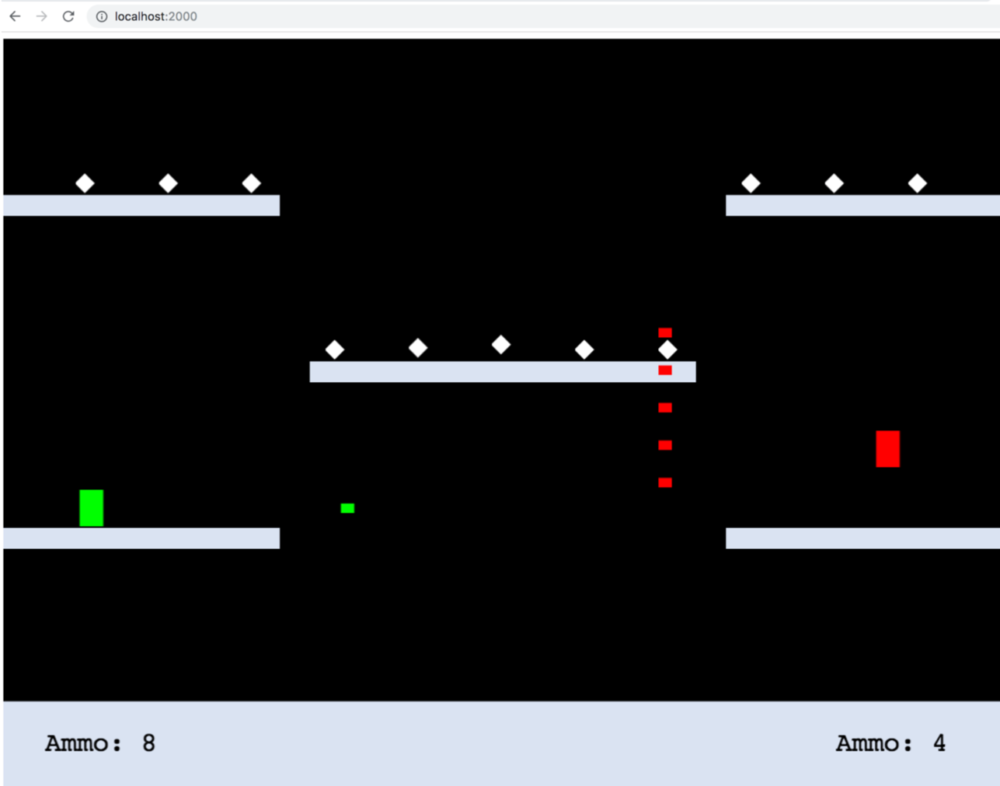

# Shoot your shot

To start the game:

1) Clone the repository.
2) Navigate this folder.
5) Install dependencies with `npm install`.
6) Start the application with `npm run start`.
5) The game should run on localhost:2000.

### Controls
Player 2: WASD movements, F to shoot, G is your ultimate
Player 1: up/down/left/right movement, M to shoot, , (comma) is your ultimate

You can configure speeds on line 72-74 of game.js

### To add
1) Online Multiplayer
2) Start Menu Screen
    a) Char Selection
    b) Stage Selection
3) Moving Platforms
